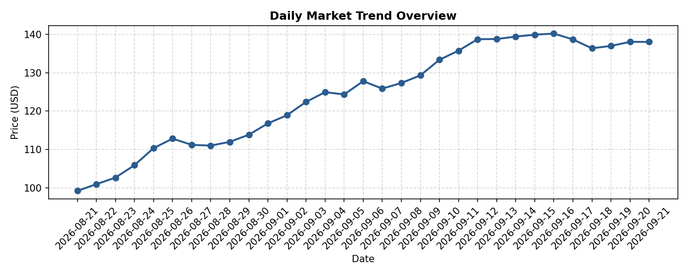

# 📈 Market Intelligence Pipeline

[](https://github.com/jamesruga/market-intel-pipeline/actions/workflows/daily_pipeline.yml)


An automated, serverless data pipeline that ingests daily market data, updates historical trend ledgers, generates visual analytical charts, and commits updated artifacts directly back to storage on a scheduled cron trigger.

---

## 📊 Live Market Trend

Below is the automatically generated daily visualization updated by the headless GitHub Actions runner.



> **Automated System Notice:** This visualization is regenerated daily at **00:00 EAT (21:00 UTC)** without human intervention.

---

## 🏗 System Architecture

The pipeline operates on an automated CI/CD loop execution model:

```text
  ┌────────────────────────┐
  │ GitHub Actions Cron    │
  │ (Everyday at 00:00 EAT)│
  └───────────┬────────────┘
              │
              ▼
  ┌────────────────────────┐
  │ Ubuntu-Latest Runner   │
  │ Set up Python & Deps   │
  └───────────┬────────────┘
              │
              ▼
  ┌────────────────────────┐      ┌────────────────────────┐
  │ Execution Phase        ├─────►│ Fetch Data & Generate  │
  │ (src/main.py)          │      │ Chart (Matplotlib)     │
  └───────────┬────────────┘      └───────────┬────────────┘
              │                               │
              ▼                               ▼
  ┌────────────────────────┐      ┌────────────────────────┐
  │ Authenticated Git Commit◄──────┤ Update Data Ledger &   │
  │ (Fine-Grained PAT Scope)│      │ Save assets/market_trend.png  │
  └───────────┬────────────┘      └───────────┬────────────┘
              │
              ▼
  ┌────────────────────────┐
  │ Push to main Branch    │
  │ (Render on README.md)  │
  └───────────┬────────────┘
```

---

## ✨ Key Features

* **Serverless Automation:** Scheduled cron workflow (`0 21 * * *` UTC) handles all ingestion, processing, and output generation in the cloud.
* **DevSecOps Standard Compliance:** Authenticated via fine-grained Personal Access Tokens (PATs) restricted to explicit repository scope (`contents: write`, `workflows: write`).
* **Lightweight CLI Execution:** Fully developed and configured out of a mobile CLI environment (Termux) and target-deployed to cloud Linux runners (`ubuntu-latest`).

---

## 🛠 Tech Stack

* **Language:** Python 3.10
* **Data & Visualization:** Matplotlib, Pandas
* **Orchestration & CI/CD:** GitHub Actions
* **Version Control:** Git, Fine-Grained GitHub PATs

---

## 📂 Project Structure

```text
market-intel-pipeline/
├── .github/
│   └── workflows/
│       └── daily_pipeline.yml    # CI/CD schedule & execution definition
├── src/
│   └── main.py                   # Ingestion, state updating, & visualization script
├── data/                         # Historical data storage
├── assets/market_trend.png              # Output chart asset embedded in README
├── requirements.txt              # Environment dependencies
└── README.md                     # Pipeline documentation & status dashboard
```

---

## 🚀 Running Locally

To run the pipeline script manually on your local system or terminal CLI:

1. **Clone the repository:**
   ```bash
   git clone [https://github.com/jamesruga/market-intel-pipeline.git](https://github.com/jamesruga/market-intel-pipeline.git)
   cd market-intel-pipeline
   ```

2. **Install dependencies:**
   ```bash
   pip install -r requirements.txt
   ```

3. **Execute the script:**
   ```bash
   python src/main.py
   ```

---

## 👤 Author

**James Ruga Mwaniki**
* GitHub: [@jamesruga](https://github.com/jamesruga)
